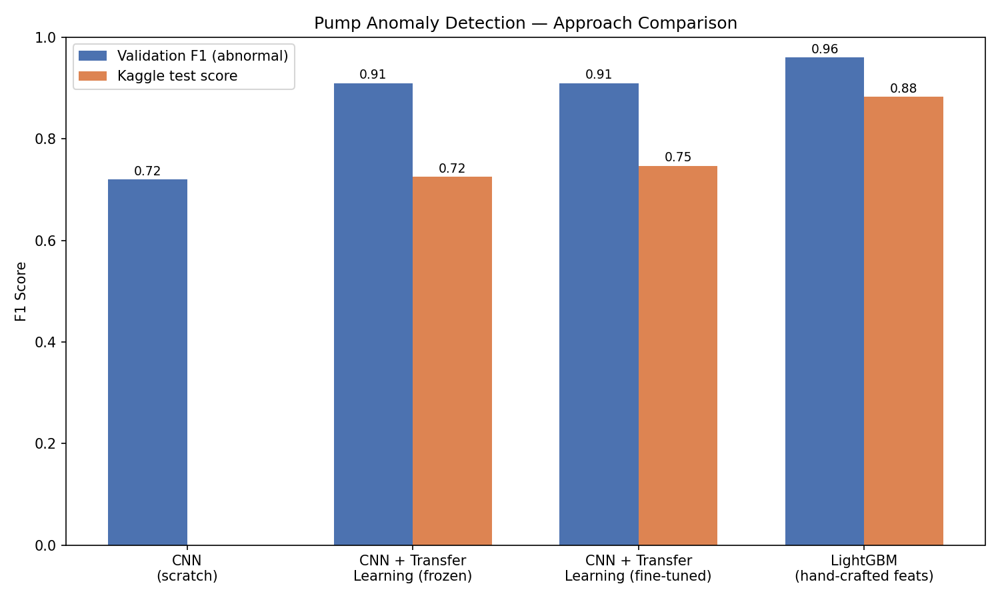
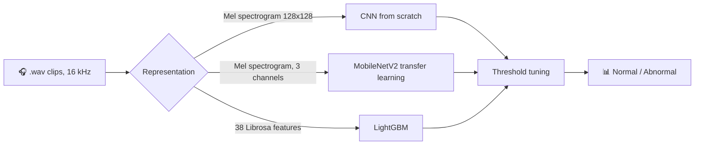
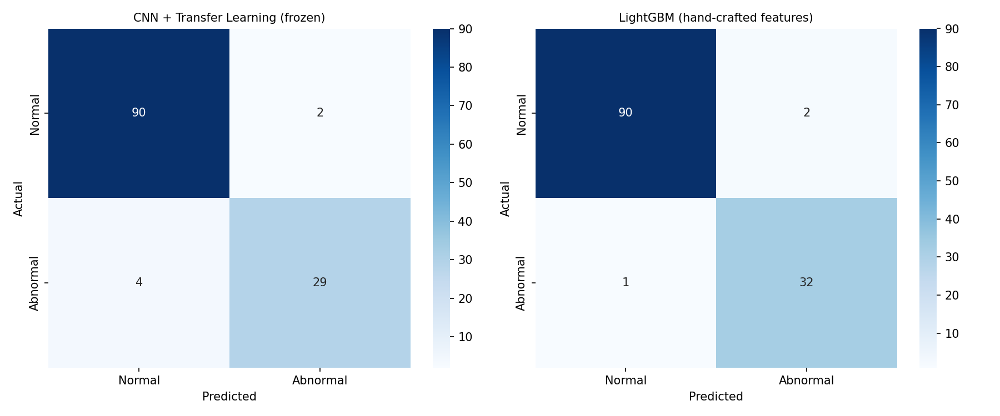

<div align="center">

# 🔊 Pump Acoustic Anomaly Detection

**Can a machine *hear* when a pump is about to fail?**
Deep learning vs. classical ML on a small industrial audio dataset.

[](https://colab.research.google.com/github/MuhammadSarimUmer/Pump-Acoustic-Anomaly-Detection/blob/main/main.ipynb)


</div>

---

## 📌 Overview

Given a `.wav` recording of a pump in operation, classify it as **normal** or **abnormal**. This is a core predictive-maintenance problem: catch mechanical faults from sound *before* they cause downtime.

I built and compared **three approaches** on the same data to find out what actually works when you only have a few hundred labeled clips.

| | |
|---|---|
| **Dataset** | Kaggle *AI Paradox* competition: 622 labeled training clips, 156 unlabeled test clips |
| **Metric** | F1 score on the **abnormal** class |
| **Class balance** | About 457 normal / 165 abnormal (≈ 2.8 : 1) |
| **Note** | The competition deadline (Oct 16, 2025) had already passed, so submissions were scored as late/practice entries and not ranked on a live leaderboard |

---

## 🏆 Results at a Glance

| Approach | Val Abnormal F1 | Val Macro F1 | Kaggle Score |
|---|:---:|:---:|:---:|
| 🧱 CNN (from scratch) | 0.72 | 0.81 | n/a |
| 🧠 MobileNetV2, frozen features | 0.91 | 0.94 | 0.72500 |
| 🧠 MobileNetV2, fine-tuned | 0.91 | n/a | 0.74698 |
| 🌲 **LightGBM (hand-crafted features)** | **0.96** | **0.97** | **0.88311** |

<div align="center">
  
</div>

> **Key takeaway:** the simplest model won. 38 hand-crafted audio features + gradient boosting beat pretrained deep learning by about **13 points** on the held-out test set.

---

## 🗂️ Pipeline



---

## 🔬 Approaches

### 1️⃣ Baseline CNN (from scratch)

- Audio (resampled to 16 kHz) → **128×128 mel spectrograms** (128 mel bands, 1024 FFT window, 512 hop length). Each clip is padded or truncated to 128 frames (~4.1 s) and scaled to [0, 1].
- Small 3-block CNN (16 → 32 → 64 filters, GlobalAveragePooling, Dense 64, Dropout 0.4), only **27,521 parameters**
- Clips are **split 80/20 (stratified) first**, then each *training* abnormal clip gets 2 augmented copies (time shift, pitch shift ±2 semitones, light noise). Validation clips are never augmented. Result: 761 training / 125 validation spectrograms.

<details>
<summary><b>🐛 Debugging story: the model that predicted one class</b></summary>

<br>

An early version with **BatchNormalization** collapsed to a single class on validation: `val_recall` frozen at 1.0 and `val_precision` frozen at the class prior. I traced it to BatchNorm's running statistics being unstable on such a small dataset. Removing BatchNorm and lowering the learning rate to `0.0005` fixed it.

</details>

| Metric | Normal | Abnormal |
|---|:---:|:---:|
| Precision | 0.89 | 0.74 |
| Recall | 0.91 | 0.70 |
| F1 | 0.90 | 0.72 |

**Macro F1: 0.81**

---

### 2️⃣ Transfer Learning (MobileNetV2)

- Same spectrograms, duplicated to 3 channels to match MobileNetV2's RGB input
- **Phase 1:** ImageNet-pretrained base frozen (2.34M total params, only 82K trainable in the new head), LR `5e-4`
- **Phase 2:** unfroze the last 30 layers (1.6M trainable) at LR `1e-5` to avoid catastrophic forgetting
- `EarlyStopping` (patience 6) and `ReduceLROnPlateau` on validation loss
- Decision threshold tuned on validation via F1 sweep (best **0.34** vs default 0.5)

| Metric | Normal | Abnormal |
|---|:---:|:---:|
| Precision | 0.96 | 0.94 |
| Recall | 0.98 | 0.88 |
| F1 | 0.97 | 0.91 |

**Macro F1: 0.94** (frozen model; fine-tuning matched but did not improve it)
**Kaggle:** 0.72500 (frozen, threshold 0.5) → 0.74698 (fine-tuned, threshold 0.34)

---

### 3️⃣ Classical ML: hand-crafted features + LightGBM ⭐

Instead of images, each full-length clip is reduced to **38 numeric features** via Librosa:

- 13 **MFCCs** (mean + std → 26 features)
- Spectral centroid, bandwidth, rolloff, zero-crossing rate, RMS energy (mean + std each → 10 features)
- Chroma (mean + std over all bins → 2 features)

LightGBM (300 estimators, `learning_rate=0.05`, `max_depth=5`, `num_leaves=15`) with `scale_pos_weight` computed from the class ratio to handle imbalance directly, without augmentation. Same stratified 80/20 split (`random_state=42`). Decision threshold tuned on validation (best **0.62**).

| Metric | Normal | Abnormal |
|---|:---:|:---:|
| Precision | 0.99 | 0.94 |
| Recall | 0.98 | 0.97 |
| F1 | 0.98 | 0.96 |

**Macro F1: 0.97 · Kaggle score: 0.88311** (best of the three)

---

## 🔍 Confusion Matrices (Validation)

<div align="center">
  
</div>

LightGBM misses **1** abnormal pump versus **4** for the frozen CNN, on the same 125-sample validation set. In predictive maintenance, a missed fault is the costly error.

---

## 🧠 Why did LightGBM win?

> This is reasoned analysis from the results, **not a proven root cause**. A proper ablation (e.g. LightGBM on spectrogram-derived features, or a CNN on hand-crafted features) would be needed to isolate the effect.

1. **Small data.** 622 clips is little for image-shaped input; even transfer learning adapts many parameters.
2. **Spectrograms have lots of irrelevant surface area.** A 128×128 grid lets a CNN latch onto spurious patterns (exact timing, background-noise position).
3. **Hand-crafted features are domain-informed compressions.** MFCCs, centroid, RMS, etc. discard the variation a CNN would have to learn to ignore from data alone.
4. **Full-clip vs. truncated input.** The CNNs only see the first ~4.1 s of each clip, while the LightGBM features summarise the whole recording. This is a confound worth testing.
5. **Possible train/test shift.** Validation came from the same recordings as training; the Kaggle test set may differ. Summary statistics tend to be more robust to this.
6. **Consistent with a known pattern:** in small-data audio ML, feature engineering + gradient boosting often beats deep learning until you reach thousands of samples per class.

Note the validation-to-test gap: CNNs drop **0.91 → 0.725–0.747**, while LightGBM drops **0.96 → 0.883**.

---

## ⚠️ Limitations

- **Small validation set** (125 samples, only 33 abnormal): a single sample can swing F1 by several points. Read results as directional.
- **No k-fold cross-validation**: a single 80/20 split was used throughout.
- **Validation set used for tuning *and* reporting**: the decision threshold (and early stopping) were chosen on the same validation data whose scores are reported, so validation F1 is slightly optimistic. The Kaggle test score is the cleaner number.
- **Confounded comparison**: CNN vs. LightGBM changes model family, feature representation *and* how much of each clip is used, so this is not a controlled experiment.
- **No live leaderboard rank**: the deadline had passed, so scores are self-assessed.

## 🚀 Future Work

- Stratified **k-fold cross-validation** with thresholds picked inside the folds
- **Ablations:** LightGBM on spectrogram features, CNN on hand-crafted features, CNN on full-length clips
- Audio-pretrained embeddings (e.g. **YAMNet / PANNs / AST**) instead of ImageNet weights
- **SpecAugment**, ensembling CNN + LightGBM probabilities, SHAP analysis of which features matter

---

## 📁 Repository Structure

```
Pump-Acoustic-Anomaly-Detection/
├── main.ipynb        # Full pipeline: EDA, CNN, MobileNetV2, LightGBM, submissions, plots
├── README.md
└── assets/
    ├── results_comparison.png
    └── confusion_matrices_comparison.png
```

## ▶️ Getting Started

The notebook is written for **Google Colab** (paths use `/content/`).

1. Click the **Open in Colab** badge above.
2. Download `train.zip` and `test.zip` (plus `sample_submission.csv`) from the Kaggle *AI Paradox* competition page and upload them to the Colab session. The data is not included in this repo.
3. Run the cells top to bottom. Training uses a fixed split (`random_state=42`) and takes a few minutes on a free GPU.

To run locally instead, install `librosa tensorflow lightgbm scikit-learn pandas matplotlib seaborn tqdm` and change the `/content/...` paths.

---

<div align="center">

**Muhammad Sarim Umer** · [GitHub](https://github.com/MuhammadSarimUmer)

⭐ If you found this useful, consider starring the repo.

</div>
